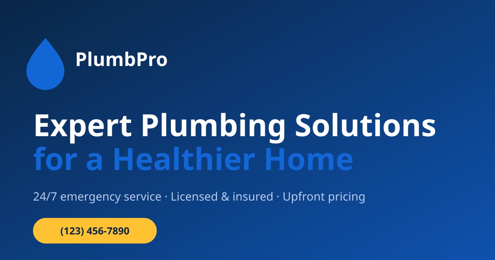

# Era-Project-02 — PlumbPro Landing Page

A production-ready, single-page marketing site for a plumbing company, built to the
attached reference design. Static HTML, CSS and vanilla JavaScript — **no build step,
no dependencies, no framework**. Clone it, open `index.html`, ship it.



## Why it's built this way

| Decision | Reason |
| --- | --- |
| No framework, no bundler | Deploys anywhere in seconds; nothing to break or update six months from now |
| CSS custom properties for the whole palette | Re-skin for a new client by editing ~15 lines |
| Semantic HTML + real `<button>` / `<a>` / ARIA | Keyboard- and screen-reader-accessible out of the box |
| `Plumber` JSON-LD schema | Eligible for rich results and local-pack signals from day one |
| SVG placeholder art | The page looks finished before the client sends photos |

## Run it locally

Any static server works — or just open the file.

```bash
# Option 1: open directly
open index.html          # macOS   (use `start` on Windows, `xdg-open` on Linux)

# Option 2: serve it (needed if you add fetch/XHR later)
npx serve .              # then visit http://localhost:3000
python3 -m http.server 8000
```

## Project layout

```
.
├── index.html            # The entire page: header → hero → services → about →
│                         # process → why-us → FAQ → testimonials → CTA → footer
├── assets/
│   ├── css/styles.css    # Tokens, base, sections, then responsive + print
│   ├── js/main.js        # Nav, dropdown, accordion, carousel, reveal, counters
│   └── img/              # SVG placeholders — replace with real photography
├── netlify.toml          # Zero-config deploy + cache headers
├── robots.txt
└── sitemap.xml
```

## Re-skinning for a different client

Every colour, font and radius is a custom property at the top of
`assets/css/styles.css`. Change these and the whole page follows:

```css
:root {
  --brand-600: #1366d6;   /* primary — buttons, links, icon chips */
  --brand-700: #0e52ae;   /* hover / gradient end */
  --brand-050: #eaf2fd;   /* tints and soft backgrounds */
  --ink-900:   #0a2647;   /* headings, dark sections, footer */
  --accent-400:#ffc233;   /* CTA buttons, highlights */
  --font-display: "Archivo", sans-serif;
  --font-body:    "Plus Jakarta Sans", sans-serif;
}
```

Swap the two Google Fonts in the `<link>` in `index.html` to match.

## Replacing the placeholder images

Files in `assets/img/` are labelled SVG stand-ins. Drop a real photo in at the same
path (any web format) and update the `src` — keep the stated aspect ratio so nothing
reflows:

| File | Used for | Ratio |
| --- | --- | --- |
| `hero-plumber.svg` | Hero photo | 18:13 |
| `about-technician.svg` | About portrait — a **cut-out PNG** sits best over the blue blob | ~23:22 |
| `why-team.svg` | Why-choose-us photo | 13:9 |
| `faq-tools.svg` | FAQ photo | 19:15 |
| `svc-*.svg` | Six service cards | 13:10 |
| `avatar-1..6.svg` | Testimonial portraits | 1:1 |
| `og-cover.svg` | Social share image | 1200×630 |

## Before going live — content checklist

Search `index.html` for these and replace every occurrence:

- [ ] `(123) 456-7890` — phone, in the header card, CTA band, footer and JSON-LD
- [ ] `info@plumbpro.com` — email
- [ ] `123 Plumbing Street, New York, NY 10001` — address (also in JSON-LD)
- [ ] `https://www.plumbpro.example/` — canonical URL, OG tags, `robots.txt`, `sitemap.xml`
- [ ] `[YOUR CITY]` / `[YOUR SERVICE RADIUS]` — the "What areas do you serve?" answer
- [ ] `[YOUR LICENCE NUMBER]` — footer
- [ ] Social links in the footer (currently pointing at bare domains)
- [ ] `aggregateRating` in the JSON-LD — **remove it unless the ratings are real**;
      fabricated review markup is a manual-action risk
- [ ] Stat figures (`15+`, `2500+`, `3500+`) and the six testimonials

## Deploying

**Netlify** — connect the repo; `netlify.toml` handles the rest.
**Vercel** — import the repo, framework preset "Other", output directory `.`.
**GitHub Pages** — Settings → Pages → deploy from `main` / root.
**Cloudflare Pages** — build command empty, output directory `/`.

## Browser support & accessibility

Tested at 1440px and 390px. Works in current Chrome, Firefox, Safari and Edge.

- Skip link, visible focus rings, `:focus-visible` outlines
- Accordion and dropdown driven by `aria-expanded` / `aria-controls`
- Carousel marks off-screen cards `aria-hidden` and exposes page dots as tabs
- Icon-only controls carry `aria-label`
- Full `prefers-reduced-motion` support — reveals, counters and autoplay all stand down
- Print stylesheet strips chrome and forces content visible

## Licence

Code in this repository is yours to use and modify. The reference design it was built
from belongs to its original author — commission or licence artwork before commercial
release.
